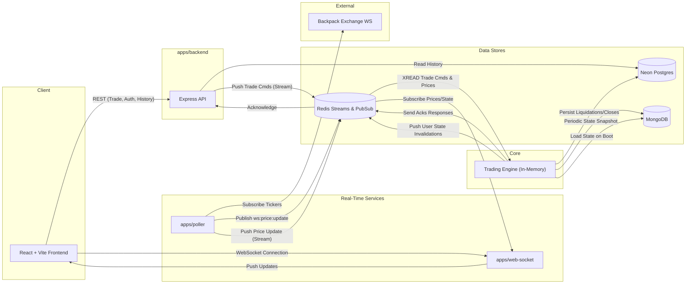

# [Opex-v2](https://opex.hrsht.me/)

**Opex-v2** is a distributed, service-oriented cryptocurrency perpetuals trading platform. It simulates real-time trading of crypto perpetual contracts (BTC, ETH, SOL) with features like leverage, cross-margin, liquidation, and real-time portfolio updates. Built as a Turborepo monorepo, it features an efficient in-memory matching engine backed by Redis Streams, MongoDB for state snapshots, and PostgreSQL for persistent trade history.

## 🎥 Demo Video

<a href="https://youtu.be/bcTubX0a9KQ" target="_blank">
  
</a>  
<p><b>Opex - The Trading App</b> <a href="https://youtu.be/bcTubX0a9KQ" target="_blank">Video ^^^</a></p>


---

## Table of Contents

1. [High-Level Architecture](#high-level-architecture)
2. [Tech Stack](#tech-stack)
3. [Project Structure](#project-structure)
4. [Engine Architecture (Deep Dive)](#engine-architecture-deep-dive)
5. [Real-Time Polling & WebSockets](#real-time-polling--websockets)
6. [Database & Persistence Strategy](#database--persistence-strategy)
7. [API Reference](#api-reference)
8. [Frontend Architecture](#frontend-architecture)
9. [Getting Started](#getting-started)
10. [Environment Variables](#environment-variables)
11. [Available Scripts](#available-scripts)

---

## High-Level Architecture



### End-to-End Data Flows

**Opening a Trade:**
```
User inputs trade details (Leverage, Asset, Size)
  → POST /api/v1/trade/open
  → Backend pushes command to Redis Stream (stream:app:info)
  → Engine pulls from Stream
  → Checks balance, calculates margin, opens trade in-memory
  → Engine pushes ACK to Redis Response Stream (stream:engine:response)
  → Backend resolves HTTP request
  → Frontend reflects new open order and updated balance
```

**Real-Time Price Updates & Liquidations:**
```
Poller receives tick from Backpack Exchange
  → Publishes tick via Redis PubSub (ws:price:update)
      → WS Server sends tick to UI
  → Pushes tick to Redis Stream (stream:app:info)
      → Engine reads tick
      → Checks if any open positions are below liquidation threshold (-90% Margin)
      → YES: Closes trade, deducts margin
          → Persists closure to PostgreSQL
          → Publishes user state change via Redis PubSub (ws:user:state:{userId})
          → WS Server notifies specific UI client to refetch balances and trades
```

---

## Tech Stack

| Technology | Role |
|---|---|
| **React + Vite** | Frontend SPA, UI, routing |
| **Node.js + Express** | Backend API and orchestration |
| **Turborepo + pnpm** | Monorepo build and dependency management |
| **Neon (Serverless Postgres)** | Primary database (Users, Closed Trades) |
| **Drizzle ORM** | Type-safe SQL query builder |
| **Redis** | Stream-based event bus, PubSub for real-time WebSockets |
| **MongoDB** | Serialization and snapshotting of the in-memory engine state |
| **Docker Compose** | Orchestration for production and local environments |

---

## Project Structure

```
opex-v2/
├── apps/
│   ├── backend/                # Express REST API (Auth, Trade Routes)
│   ├── engine/                 # Stateful Matching & Liquidation Engine
│   ├── poller/                 # Price Oracle (Subscribes to Backpack -> Publishes to Redis)
│   ├── web-socket/             # WS Server (Pushes Prices & User State to React)
│   └── frontend/               # React Vite SPA UI
│
├── packages/
│   ├── db/                     # Drizzle schema, migrations, typed db client
│   ├── redis/                  # Shared Redis connection instances (Queue, PubSub)
│   ├── types/                  # Shared TypeScript interfaces & Zod schemas
│   ├── eslint-config/          # Shared linting rules
│   └── typescript-config/      # Shared TS configurations
│
└── docker-compose.production.yml # Docker deployment manifest
```

---

## Engine Architecture (Deep Dive)

The `apps/engine` service is the core of Opex-v2. It operates asynchronously utilizing a Redis Stream message broker (`stream:app:info`).

### Sequential State Machine
The engine holds the active state in memory for performance, operating as a single-threaded consumer of the unified Redis Stream. This ensures strict ordering of events:
1. Trade Opens 
2. Trade Closes
3. Price Updates (Liquidation checks)

### Recovery & Resilience
To optimize recovery time in the event of an engine restart:
- Every 5 seconds, the engine serializes its memory map (Prices, Open Orders, User Balances, Last Stream ID) and upserts it as a single JSON blob into **MongoDB**.
- On startup, the engine queries MongoDB for the last snapshot.
- It then queries the Redis Stream to replay only the events (from the last consumed ID) that happened *after* the snapshot was taken, achieving rapid recovery.

---

## Real-Time Polling & WebSockets

### The Poller (`apps/poller`)
A lightweight bridging service. It establishes a WebSocket connection to Backpack Exchange, listening for ticker data (e.g., `BTC_USDC_PERP`). 
- **Fast Path:** It publishes this data to a Redis PubSub channel (`ws:price:update`).
- **Engine Path:** It simultaneously queues the price data into the Engine's Redis Stream so the engine can process margin impact.

### The WebSocket Server (`apps/web-socket`)
The WS server scales horizontally. It acts as a messaging layer and does not contain trading logic:
1. Subscribes to the global `ws:price:update` channel and broadcasts fast ticker prices to all connected browsers.
2. Subscribes to patterned user channels (`ws:user:state:*`). If the engine liquidates a user, it pings this user's channel. The WS server forwards this to the user's specific browser connection, triggering the frontend to refetch relevant data.

---

## Database & Persistence Strategy

### PostgreSQL (via Drizzle ORM)
Used for persistent, immutable records requiring relational querying:
- **`users` table**: Authentication data, core permanent balances.
- **`existing_trades` table**: Successfully closed or liquidated trades are inserted here to act as the user's transaction history.

### Redis
Used for ephemeral state and messaging:
- **`stream:app:info`**: Primary event log driving the Engine.
- **`stream:engine:response`**: The acknowledgement stream that the Express API waits on to resolve HTTP calls.
- **PubSub**: Transient pushing of live prices and state invalidations.

### MongoDB
Used uniquely for state-snapshotting the Engine to provide rapid boot-ups without querying relational data.

---

## API Reference

### Auth

| Method | Path | Description |
|---|---|---|
| `POST` | `/api/v1/user/signup` | Create User |
| `POST` | `/api/v1/user/signin` | Authenticate and get JWT cookie |
| `GET` | `/api/v1/user/whoami` | Verify JWT and get user profile |
| `POST` | `/api/v1/user/logout` | Clear JWT cookie |

### Balances

| Method | Path | Description |
|---|---|---|
| `GET` | `/api/v1/balance` | Get USD balance |
| `GET` | `/api/v1/balance/asset` | Get unrealized asset margin balances |

### Trades

| Method | Path | Body | Description |
|---|---|---|---|
| `POST` | `/api/v1/trade/open` | `{ asset, type(long/short), leverage, ... }` | Open a position |
| `GET` | `/api/v1/trade/open` | — | Fetch current active positions |
| `POST` | `/api/v1/trade/close`| `{ orderId }` | Close an active position |
| `GET` | `/api/v1/trade/closed`| — | Fetch historical closed/liquidated trades |

---

## Frontend Architecture

**Framework:** React 18 / Vite SPA.

| Concept | Purpose |
|---|---|
| **Routing** | React Router (`react-router-dom`) with `ProtectedRoute` wrappers for authenticated views (`/trade`, `/past-orders`). |
| **State Management** | React Query (`@tanstack/react-query`) handles fetching and caching for the REST API. |
| **Real-time Engine** | A custom singleton `WSClient` handles real-time ticker quotes and emits events that tell React Query to invalidate its caches immediately when the backend engine changes user state (like liquidations). |

---

## Getting Started

### Prerequisites

- Node.js ≥ 20
- pnpm ≥ 9
- Neon Postgres database (or local Postgres)
- Redis Server
- MongoDB Server

### Installation

```bash
git clone https://github.com/iBreakProd/opex-v2.git
cd opex-v2
pnpm install
```

### Database Setup

```bash
pnpm --filter @repo/db db:push # Make sure to generate and apply Drizzle changes
```

### Development

```bash
# Run all apps concurrently via Turborepo
pnpm dev
```

### Production Build

```bash
pnpm build
```

---

## Environment Variables

A combination of global and app-specific variables. Provide `.env` files in root or respective app directories.

| Variable | Description |
|---|---|
| `DATABASE_URL` | Neon/Postgres connection string |
| `REDIS_URL` | Redis connection string |
| `MONGO_URL` | MongoDB connection string |
| `BACKPACK_URL` | Poller endpoint (`wss://ws.backpack.exchange`) |
| `JWT_PASSWORD` | Secret for signing JWTs |
| `HTTP_PORT` | Backend Express Port (Default 3000) |
| `WS_PORT` | WebSocket Server Port (Default 8080) |
| `CORS_ORIGIN` | Allowed domains for the frontend |
| `VITE_BACKEND_URL` | Frontend env target for Express API |
| `VITE_WS_URL` | Frontend env target for WS Server |

---

## Available Scripts

| Script | Command | Description |
|---|---|---|
| `dev` | `pnpm dev` | Run all apps in watch mode |
| `build` | `pnpm build` | Compile all packages and apps |
| `start` | `pnpm start` | Run compiled apps |
| `lint` | `pnpm lint` | Run ESLint across packages |
| `db:generate`| `pnpm --filter @repo/db generate` | Generate Drizzle migrations |
| `db:push` | `pnpm --filter @repo/db db:push` | Push schema directly to DB |
